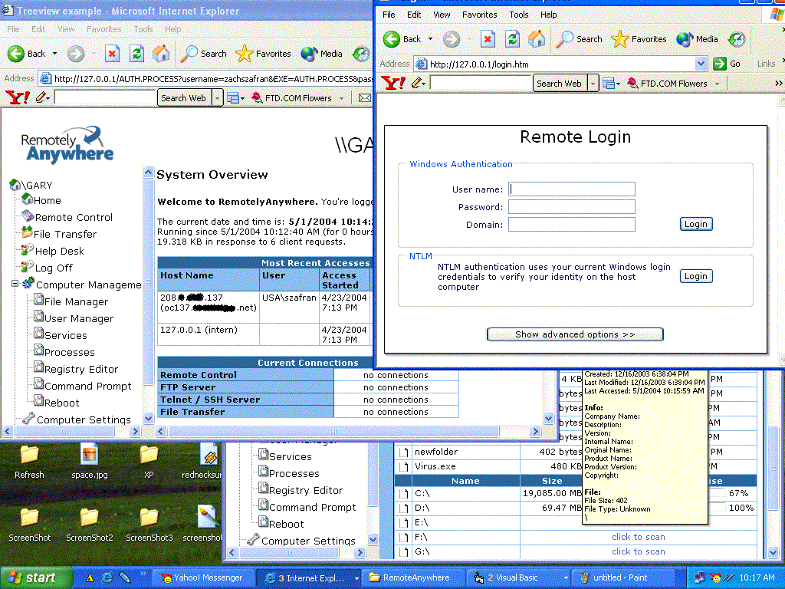



## RemotelyAnywhere \(Remote administration through IE\)

### Description

This is a replica of the RemotelyAnywhere program. This is unfinished.... i put a lot of functions into this project. The filemanager and the command prompt work. The this program is started on a computer you can connect to it through Internet Explorer simply by typing in the IP address to that machine.... After doing so a loging screen will be displayed.... this in return will allow you to browse that computer. There is a great layout included in this along with Javascript and vb script..... please tell me what you think and feel free to add more onto this project....
 
### More Info
 

             |
---                |---
**Submitted On**   |2004-05-01 10:12:08
**By**             |[Eric Wolcott](https://github.com/Planet-Source-Code/PSCIndex/blob/master/ByAuthor/eric-wolcott.md)
**Level**          |Intermediate
**User Rating**    |4.8 (43 globes from 9 users)
**Compatibility**  |VB 3\.0, VB 4\.0 \(16\-bit\), VB 4\.0 \(32\-bit\), VB 5\.0, VB 6\.0
**Category**       |[Internet/ HTML](https://github.com/Planet-Source-Code/PSCIndex/blob/master/ByCategory/internet-html__1-34.md)
**World**          |[Visual Basic](https://github.com/Planet-Source-Code/PSCIndex/blob/master/ByWorld/visual-basic.md)
**Archive File**   |[RemotelyAn173950512004\.zip](https://github.com/Planet-Source-Code/eric-wolcott-remotelyanywhere-remote-administration-through-ie__1-53496/archive/master.zip)

